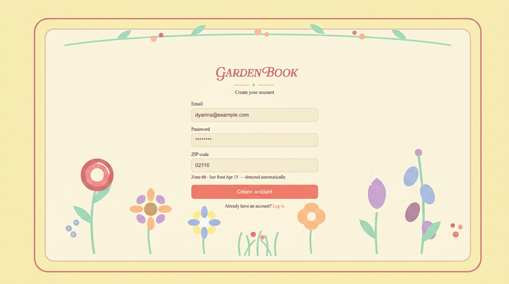
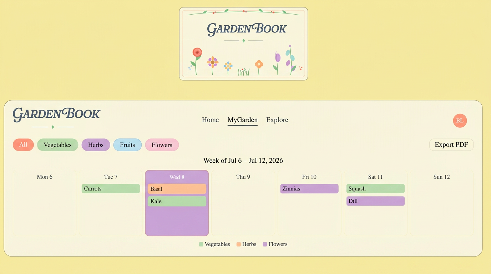
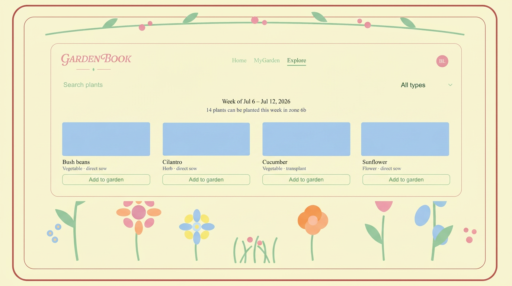
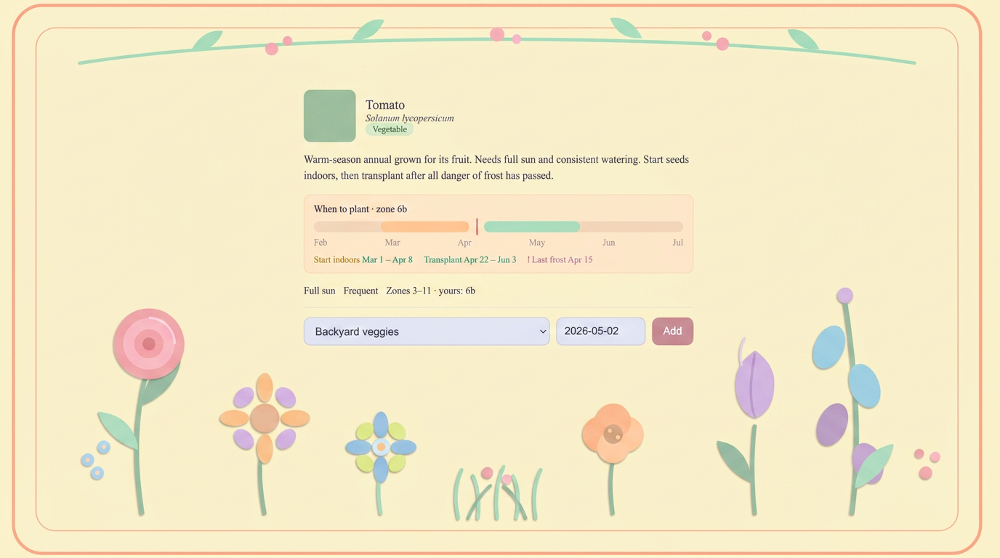

# Design Document

## GardenBook

## Barbara Louyakis & Aleena Karatra

### CS5610 Web Development - Project 3

---

## Project Description

This web application was developed for CS5610 Web Development at Northeastern University during the Summer 2026 semester. It is a full-stack garden planning calendar that allows users to organize plants into typed gardens (vegetables, fruits, herbs, flowers), schedule each planting on a weekly calendar, discover what can be planted in their region during any given week, and export weekly calendar views as printable PDFs.

Users authenticate via a login and registration system secured with bcrypt password hashing. Authentication is handled using Passport.js with the Local Strategy to manage credential verification, and sessions are managed with express-session: on login, the server establishes a session and the browser holds a signed session cookie. All garden, planting, and calendar API routes are protected by an `isAuthenticated` middleware that returns 401 for requests without a valid session. The application was designed using the following technology stack:

- **Backend:** Node.js, Express 5, MongoDB (native Node.js driver)
- **Frontend:** React 19 (hooks), React Router 7, React Bootstrap, Vite, HTML5, CSS3
- **Authentication:** Passport.js (Local Strategy), bcrypt, express-session
- **PDF Export:** PDFKit (calendar export)
- **External APIs:** Perenual (plant catalog), phzmapi.org (USDA zones), FarmSense (frost dates)
- **Dev Tools:** Node --watch, ESLint, Prettier
- **License:** MIT

The application is a single-page React app with 6 routes:

- **/** (HomePage) — landing page with buttons into each garden view (MyGarden, MyVegetables, MyHerbs, MyFruits, MyFlowers) and Explore Gardens
- **/login** (LoginPage) — email + password login via Passport local strategy
- **/register** (RegisterPage) — account creation with name, email, password, and ZIP code; the ZIP is resolved to a USDA hardiness zone and frost dates at registration
- **/mygarden** (MyGardenPage) — weekly calendar of the user's plantings across all gardens, with a garden-type toggle (`?type=vegetable|herb|fruit|flower`)
- **/mygarden/:gardenId** (MyGardenPage) — the same weekly calendar scoped to a single garden
- **/explore** (ExplorePage) — search bar, week navigation, and a grid of every plant plantable in the user's region during the displayed week; clicking a plant opens a detail modal with a summary, region-specific planting windows, and an add-to-garden form

### Navigation

```
/login <——> /register
   |
   ├──── / (Home: garden buttons + Explore)
   |        ├──── /mygarden (weekly calendar, all gardens)
   |        |        └──── /mygarden?type=... (per-type toggle)
   |        |        └──── /mygarden/:gardenId (single garden)
   |        |                 └──── Export PDF (GET /api/calendar/export)
   |        └──── /explore (plantable-this-week grid + search)
   |                 └──── Plant detail modal ——> add to garden
```

---

## GitHub

[Click to view GitHub](https://github.com/blouyakis/gardenbook)

---

## Video Demonstration

[Click to view Video Demonstration](https://....)

---

## API Routes

**Auth:** `POST /api/auth/register`, `POST /api/auth/login`, `POST /api/auth/logout`, `GET /api/auth/session`, `PUT /api/auth/password`, `DELETE /api/auth/account`

**Users:** `GET /api/users/me`, `PUT /api/users/me`

**Plants:** `GET /api/plants?search=&week=&type=`, `GET /api/plants/:id`

**Gardens:** `GET /api/gardens`, `POST /api/gardens`, `PUT /api/gardens/:id`, `DELETE /api/gardens/:id`

**Plantings:** `POST /api/gardens/:gardenId/plantings`, `PUT /api/gardens/:gardenId/plantings/:id`, `DELETE /api/gardens/:gardenId/plantings/:id`

**Calendar:** `GET /api/calendar?week=`, `GET /api/calendar/:gardenId?week=`, `GET /api/calendar/export?week=&gardenId=`

---

## Database Design

MongoDB with the native driver (no Mongoose). Five collections:

- **users** — `{ email (unique index), passwordHash, displayName, region: { zip, zone, lastFrost, firstFrost }, createdAt }`
- **gardens** — `{ userId, name, type, createdAt }`
- **plantings** — `{ userId, gardenId, plantId, plantedDate, notes, createdAt }` with a compound index on `{ userId, plantedDate }`; `userId` is denormalized so the all-gardens calendar is a single query
- **plants** — Perenual cache keyed by Perenual species id (`_id`): `{ commonName, scientificName, type, imageUrl, summary, hardiness: { min, max }, cachedAt }`. Perenual's free tier is rate-limited to 100 requests/day, so the app always serves from this cache
- **plantingWindows** — our curated frost-offset data: `{ plantId, startOffsetWeeks, endOffsetWeeks, method }`, where offsets are weeks relative to the user's last frost date

---

## User Personas & User Stories

### Remote Employee — "Dyanna," 39, microbiologist who works remotely from home.

As a seasoned biologist working remotely from home, I want to plan out my garden work weekly so I can set aside time between meetings and during lunch to get my garden duties done. I like knowing what to plant ahead of time, and keeping it all organized has been a challenge. I want to quickly see the plants that thrive in my environment and when I have extra space, I want to have a list of options to choose from that can fill that bed. I don't have time to research every plant, so an easy way to see what thrives in my region would be a big help.

### Farmer — "Mark," 60, runs a family-owned farmstead and manages the local farm stand.

As a farmer planting on the land of my ancestors and helping to feed my community, I want one calendar that combines all of my gardens so I can plan planting across my land while keeping everything I grow well-organized, both in my head and on the farm. I want to export a weekly PDF to pin up in the barn and pass out to the farmworkers that come help me plant throughout the season. That way, my family and my employees all know what work needs to be done and when, which will help all of us work better together.

### Business Owner — "Jose," 30, runs a marine services company near a busy fishing port.

As a marine services provider who works out of my truck and is always on the go, I want to manage my small home garden from my phone during downtime at the docks. I want to browse future weeks on the Explore page so I can plan my yard & garden work around my unpredictable schedule. If all my garden information is accessible on my phone, I can stop by the garden store on my way home at night to pickup everything I need for planting the next morning. It would also be great to add more plants when I have free time between jobs, so a browsable list of plants that I could add this week would be very convenient. A weekly calendar will help me keep all this information organized so I don't forget what I am supposed to get in the ground and when.

---

## Work Distribution:

Aleena Karatra: Auth + sessions (register, login, logout, session check — Passport, bcrypt); user profile + region setting (backend routes + settings UI); Gardens CRUD (routes, Mongo collections, and the garden management UI); PDF export (PDFKit route + export button/flow in the calendar views).

Barbara Louyakis: External plant API integration (proxy routes, region/week filtering, response caching); Explore page (search bar, plant grid with photos, plant detail with summary and when-to-plant, week navigation); Plantings (add-to-garden flow from Explore, edit/remove, backend routes); MyGarden weekly calendar (aggregate and per-garden views with type toggle).

---

### Design Mockups






### Final Screenshots


