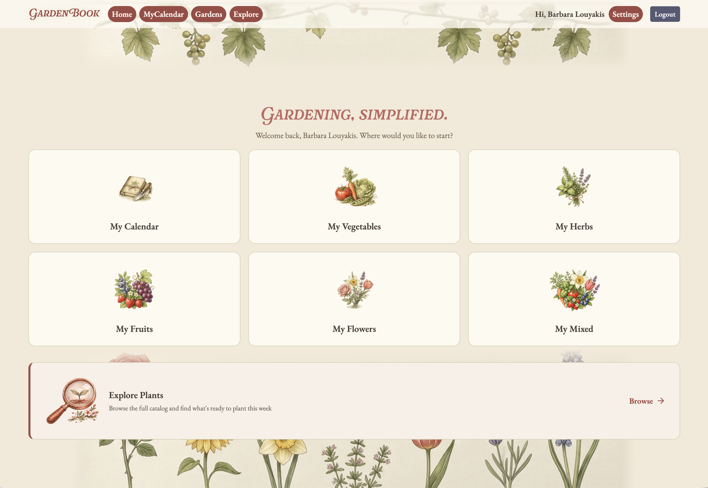

# About GardenBook

GardenBook is a full-stack web application that helps gardeners plan what to plant and when to plant it. Users can explore plants without an account or create an account, set their region, and organize plants into garden types: vegetables, fruits, herbs, and flowers. The MyGarden page displays a weekly calendar of the user's selected plants on their intended planting dates. They can toggle the calendar by garden type or view the full garden. The Explore page displays every plant that can be grown in the user's region, sorted by what should be planted during the specified week. This feature pulls data from Perenual's public API and lets users browse past and future weeks. They can also export any weekly calendar view, all gardens from MyGarden or a specific type of garden, as a PDF that they can save locally or print.



---

## Class

[CS 5610 Web Development](https://johnguerra.co/classes/webDevelopment_online_summer_2026/)

Khoury College of Computer Sciences, Northeastern University

---

## Development Environment

Full stack web application using Node + Express 5 + MongoDB native driver + React 19 (hooks), React Router, Vite, Passport (session auth), bcrypt (password hashing), PDFKit (calendar PDF export), React Bootstrap (UI)

### APIs

Perenual (plant catalog, photos, summaries, zones), USDA Hardiness Zone — phzmapi.org (ZIP -> zone)
An earlier design used the FarmSense frost API, but its endpoint was retired, frost dates are now estimated from the resolved zone so registration never depends on a live external call. Zones 1–13 are supported, including frost-free zones 11–13.

### Mongo DB Atlas

Collections: `users`, `gardens`, `plantings`, `plants` (Perenual cache — the API has a 100 req/day rate limit, so we serve from cache), `plantingWindows` (our curated frost-offset data)

---

## Features

- Account registration with automatic region detection (ZIP -> USDA zone + frost dates)
- Password confirmation on registration and password changes to catch typos before they lock you out
- Gardens organized by type: vegetables, fruits, herbs, flowers
- View a garden's plants: expand any garden on the Gardens page to see and remove its plantings
- MyGarden weekly calendar with garden type toggle
- Explore page: search every plant plantable in your region for any week, past or future
- Plant catalog of 80+ vegetables, herbs, fruits, and flowers, organized into sections by type
- All-plants view: browse the full catalog or filter to what's plantable in a selected week
- Planting window indicators: green borders mark plants in their ideal window, gold marks the flexible edge, with an on-page legend
- Plant detail view with region-specific planting windows
- Plant details open from anywhere a plant appears: Explore, a garden's plant list, or the calendar
- Add a plant to a specific garden directly from its detail view with a context-aware garden picker
- Full keyboard and screen reader support: WCAG AA headings, labels, and alerts, verified by a 100% Lighthouse accessibility score
- Generate a formatted PDF garden calendar (full garden or single garden type)

---

## Project Information

### Live Website

#### Project 4

The application is deployed and publicly accessible at:

[GardenBook Project 4](https://gardenbook-p4.onrender.com/)

URL: https://gardenbook-p4.onrender.com/

A demo account has been pre-loaded with sample data so you can explore the application without creating an account or adding data manually.

#### Project 3

The application is deployed and publicly accessible at:

[GardenBook Project 3](https://gardenbook-tozv.onrender.com)

URL: https://gardenbook-tozv.onrender.com

A demo account has been pre-loaded with sample data so you can explore the application without creating an account or adding data manually.

### Slide Presentation

[Click here to view the Slide Presentation](https://docs.google.com/presentation/d/e/2PACX-1vSKaliN8gi_RbZjXbkeov8gsCdpZP42VO73hbgy02RzLqErIJ8fmYGaWc9mkWr5paErvGr90_VOxS0z/pub?start=false&loop=false&delayms=3000)

### Video Demonstration

[Click here to watch the Video Demonstration](https://drive.google.com/file/d/1mE-usFEliQS-aKUm7XZccVT6hDro5jfp/view?usp=sharing)

### GitHub

[Click here to view the GitHub repo]
(https://github.com/blouyakis/gardenbook/tree/dev-usability)

---

## Setup

> 1.  Environment Variables: Create a new file in the root called `.env`, generate a session secret and copy the Perenual API key from the canvas assignment submission comment section
>
> Create a `.env` file in the project root with the following:

```
MONGODB_URI=mongodb+srv://<username>:<password>@<cluster>.mongodb.net/
DB_NAME=gardenbook
SESSION_SECRET=<generate one>
PERENUAL_API_KEY=<see comment in canvas assignment>
PORT=3000
```

> 2.  Backend — from the project root: `npm install` then `npm start` (port 3000)

> 3.  Frontend — in a second terminal: `cd frontend` then `npm install && npm run dev` (port 5173)

> 4.  Seed planting windows — from the project root: `npm run seed:users && npm run seed && npm run seed:demo` - If the demo data gets modified or deleted, you can restore it by running:

```bash
npm run seed:users
npm run seed
npm run seed:demo
```

> 5.  Running the App (production build)

```bash
cd frontend
npm run build
npm run dev
cd ..
npm start
```

> Then go to `http://localhost:3000` in your browser. (During development, use the two-terminal setup above and browse at `http://localhost:5173`.)

>Note: To generate the MONGODB_URI: create a free cluster at [mongodb.com/atlas](https://mongodb.com/atlas)

### Login Credentials

| Field    | Value        |
| -------- | ------------ |
| Email    | demo@neu.edu |
| Password | Northeastern |

### How to Access

1. Go to the live URL above
2. Enter the credentials above and click **Log In**
3. Browse the MyGarden weekly calendar, or open Explore to see what can be planted in the demo region this week

---

## Work Ownership

- **Aleena** — auth + sessions, users/region, gardens CRUD, PDF export, all-plants explore view, context-aware garden picker
- **Barbara** — plant API integration + cache, Explore, plantings, calendar views, catalog expansion, manual seeding, flexible planting windows, plant detail access from gardens and calendar, password confirmation, accessibility features
- **Shared** — Usability study and debugging

---

## Authors

- Barbara Louyakis
- Aleena Mary Karatra

---

## AI Assistance

Tool: Claude (Anthropic)

- Version: Fable 5
- URL: https://claude.ai
- Usage: Used for creating findIds.js and for formatting plantingWindows.sample.json to generate the seeded data from Perenual API.

Tool: Claude (Anthropic)

- Version: Opus 4.8
- URL: https://claude.ai
- Usage: Used for creating stubs to help with observing development flow, and identifying bugs across areas with shared scopes.

---

## License

MIT
